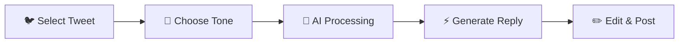

# 🤖 X Auto Reply Assistant

> 🚀 **Generate natural, context-aware replies that feel authentically human on X/Twitter!**

## 🆕 What's New in v2.1.41

### 🛠️ **Custom Model Support**
- 🎯 Use any OpenRouter model by entering custom model names
- 🚀 Support for latest models like `x-ai/grok-4-fast:free`, `anthropic/claude-sonnet-4.5`
- 🔧 Easy configuration through dropdown selection

### 💼 **X Pro Compatibility**
- ✅ Full support for `pro.x.com`
- 🔄 Seamless functionality across all X platforms
- 🎯 Enhanced user experience for X Pro users

## ✨ Features

### 🧠 **Smart AI Integration**
- 🔥 Powered by **Gemini API** & **OpenRouter**
- 🎯 Context-aware response generation
- 🤖 Multiple AI model support
- 🛠️ **Custom Model Support** - Use any OpenRouter model (e.g., `x-ai/grok-4-fast:free`, `anthropic/claude-sonnet-4.5`)

### ⚡ **Lightning Fast Performance**
- 🚀 Generate replies in seconds
- 💨 Seamless Twitter integration
- 🔄 Real-time response generation

### 🎭 **Customizable Tones**
- 💼 **Professional** - For business interactions
- 😊 **Casual** - For friendly conversations
- 🤝 **Friendly** - For warm engagement
- 😄 **Witty** - For humorous responses

### 🌐 **Platform Support**
- 🐦 **X/Twitter** - Full support for twitter.com and x.com
- 💼 **X Pro** - Complete compatibility with pro.x.com
- 🔄 Seamless cross-platform functionality

### 🛡️ **Privacy & Security**
- 🔐 API keys stored locally
- 🚫 No data collection
- 🛡️ Privacy-first design
- 🔒 Secure local storage

## 📥 Installation

### 🌟 From Chrome Web Store (Recommended)

1. 🔗 **[Download from Chrome Web Store](https://chromewebstore.google.com/detail/x-auto-reply-assistant/hopmlipidbngnbkokpjllfflnedfajfc?pli=1)**
2. 📌 Click "Add to Chrome"
3. ✅ Confirm installation
4. 🎉 Start generating amazing replies!

## 🚀 Quick Start Guide

### 1️⃣ **Setup API Keys**
- 🔑 Click the extension icon in your toolbar
- ⚙️ Go to Settings tab
- 🔐 Add your Gemini API or OpenRouter key
- 🛠️ **For OpenRouter**: Choose a model or select "Custom Model" to enter your preferred model name
- 💾 Save your preferences

### 2️⃣ **Generate Your First Reply**
- 🐦 Navigate to X/Twitter
- 📝 Find a tweet you want to reply to
- 🎯 Click the "Generate Reply" button
- 🎭 Choose your desired tone
- ⚡ Watch the magic happen!

### 3️⃣ **Customize & Post**
- ✏️ Edit the generated reply if needed
- 📤 Post directly or copy to clipboard
- 🎉 Engage with authentic, AI-powered responses!

## 🎯 Perfect For

- 💼 **Business Professionals** managing social media presence
- 📱 **Content Creators** engaging with their audience
- 🤝 **Community Managers** handling customer support
- 👥 **Social Media Enthusiasts** wanting better engagement
- 🚀 **Anyone** looking to save time on Twitter responses

## 🔧 Configuration

### 🤖 **Supported AI Providers**

#### 🟢 **Gemini API**
- 🆓 Free tier available
- 🚀 Fast response times
- 🎯 Excellent context understanding

#### 🔵 **OpenRouter**
- 🌐 Multiple model access
- 💪 Advanced AI capabilities
- 🔄 Model switching options
- 🛠️ **Custom Model Support** - Enter any model name (e.g., `x-ai/grok-4-fast:free`, `anthropic/claude-sonnet-4.5`, `meta-llama/llama-3.1-8b-instruct:free`)

### ⚙️ **Settings Options**
- 🎭 Default tone selection
- 📝 Custom default text
- 🔑 API key management
- 🎨 Response customization
- 🛠️ **Custom Model Configuration** - Select "Custom Model" from OpenRouter dropdown and enter your preferred model name

## 📊 How It Works

1. 📝 **Tweet Selection** - Choose any tweet to reply to
2. 🎭 **Tone Selection** - Pick the perfect response style
3. 🤖 **AI Processing** - Advanced context analysis
4. ⚡ **Reply Generation** - Natural, human-like responses
5. 📤 **Post & Engage** - Share your authentic reply

## 🛡️ Privacy & Security

- 🔐 **Local Storage Only** - API keys never leave your device
- 🚫 **No Data Collection** - We don't track or store your data
- 🛡️ **Privacy First** - Your conversations stay private
- 🔒 **Secure Processing** - All operations happen locally

## 🤝 Contributing

We welcome contributions! 🎉

1. 🍴 Fork the repository
2. 🌿 Create a feature branch
3. 💻 Make your changes
4. 🧪 Test thoroughly
5. 📤 Submit a pull request

## 📝 License

This project is licensed under the MIT License - see the [LICENSE](LICENSE) file for details.

## 🆘 Support

- 📧 **Email**: hexquant@gmail.com
- 🐛 **Issues**: [GitHub Issues](https://github.com/xPOURY4/X-Auto-Reply-Assistant/issues)
- 💬 **Discussions**: [GitHub Discussions](https://github.com/xPOURY4/X-Auto-Reply-Assistant/discussions)
- 🐦 **X/Twitter**: [@TheRealPourya](https://x.com/TheRealPourya)
- 📱 **Telegram**: HexQuant hub

## 🌟 Show Your Support

If you find this extension helpful:

- ⭐ Star this repository
- 🔄 Share with friends
- 📝 Leave a review on Chrome Web Store
- 🐦 Tweet about it!

---

**🚀 Transform your Twitter engagement today! 🌟**

*Made with ❤️ for the Twitter community*

